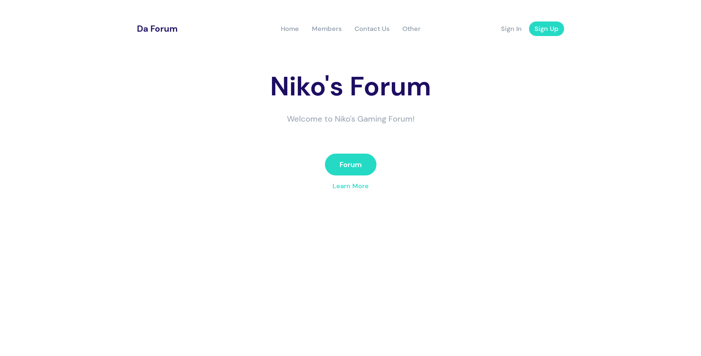
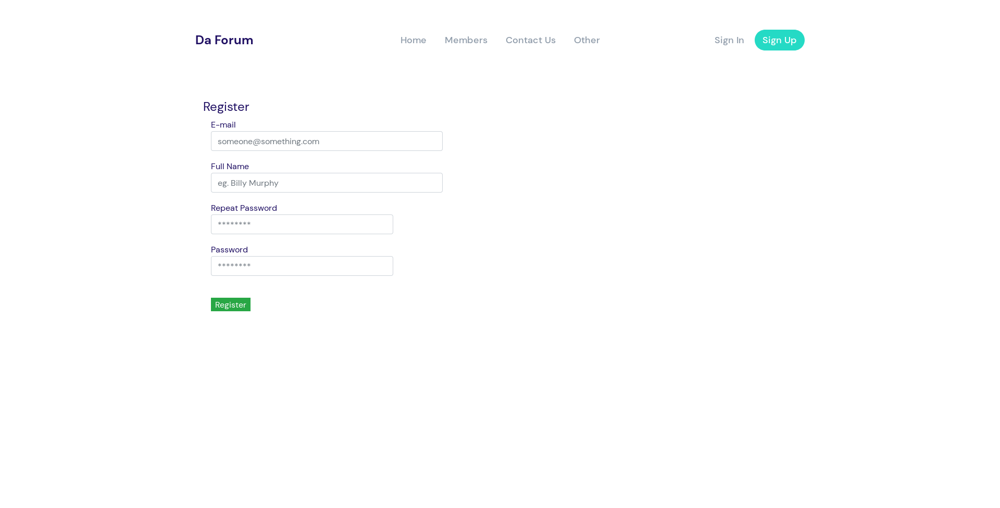

# zForum

## This is a project website which I am making as part as my internship in RedHat
## This is what my websites index looks like currently;

## This is a what the sign-up page currently looks like 

## Technologies Used
- Javascript
- HTML
- CSS

## Libraries Used
- [jQuery (bundled with plugins)](https://designmodo.com/startup/app/)
- [Bootstrap 4.3 modified](https://getbootstrap.com/)
- [Startup 3 Free](https://designmodo.com)

## Live Website
### [zForum](https://xnexeon.github.io/zForum/)
